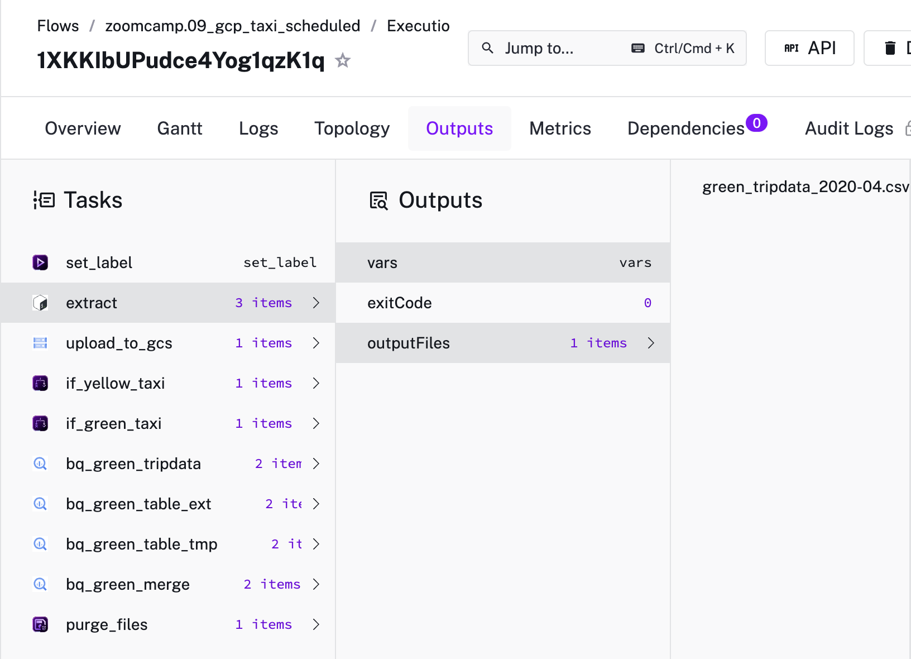
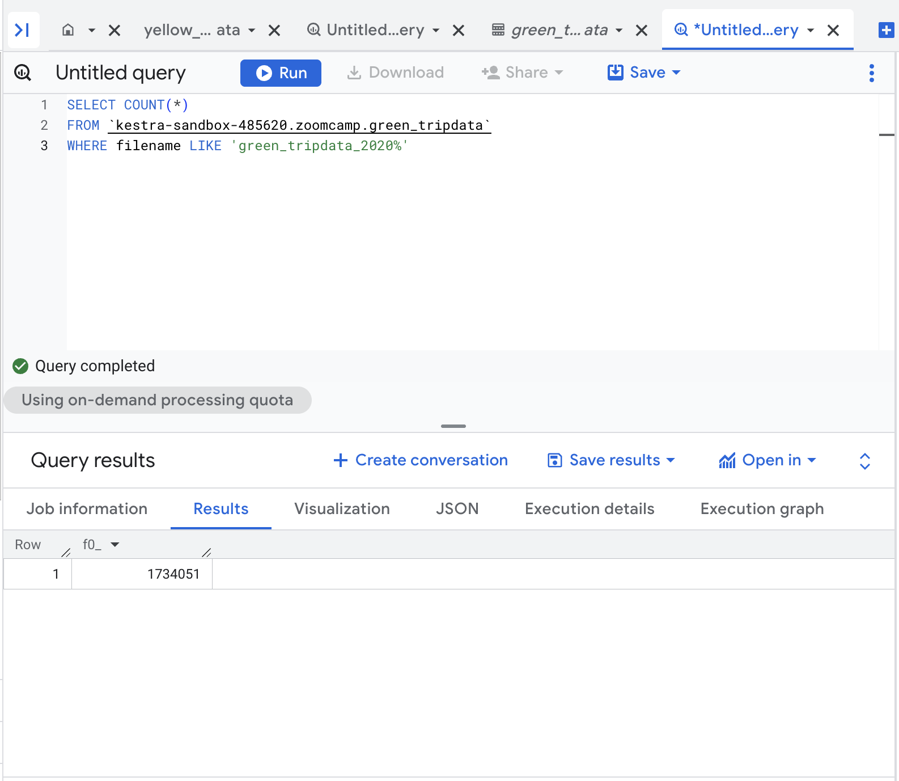
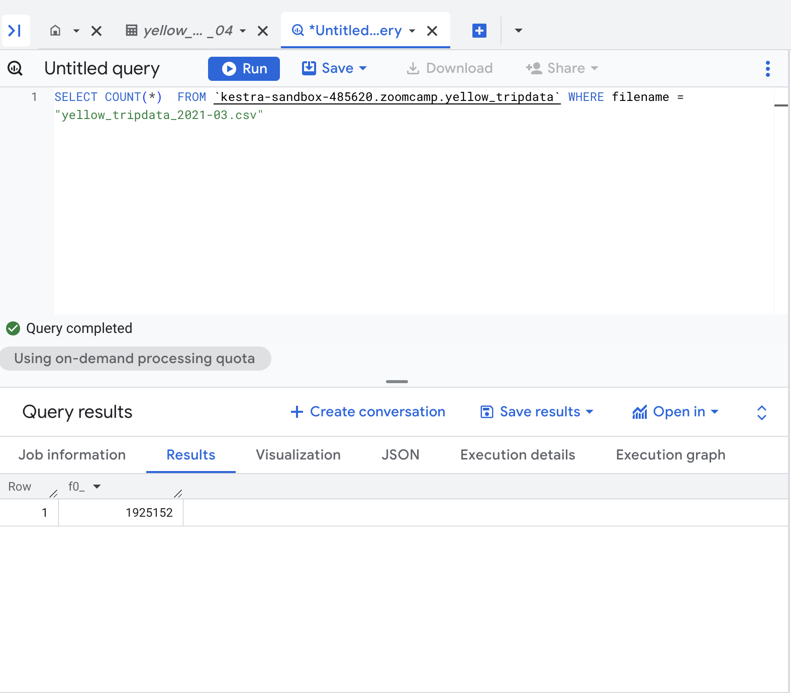

# Question 1
Within the execution for Yellow Taxi data for the year 2020 and month 12: what is the uncompressed file size (i.e. the output file yellow_tripdata_2020-12.csv of the extract task)?


For this assignment, I loaded all of the green and yellow tripdata into Bigquery. From there, I navigated to `Cloud storage > Overview` and searched for `yellow_tripdata_2020-12.csv`


The size of the csv file is 134.5 MB. After converting 134.5 to Mib, it is 128.3 MiB (rounded).

# Question 2
What is the rendered value of the variable file when the inputs taxi is set to green, year is set to 2020, and month is set to 04 during execution?

In the Kestra execution logs for green_tripdata_202-04, the `extract` task shows the `file` variable resolved to `green_tripdata_2020-04.csv`




# Question 3

How many rows are there for the Yellow Taxi data for all CSV files in the year 2020?


```SQL
SELECT COUNT(*) FROM `kestra-sandbox-485620.zoomcamp.yellow_tripdata` WHERE filename = "yellow_tripdata_2020%;"
```

```
24,648,499
```

# Question 4
How many rows are there for the Green Taxi data for all CSV files in the year 2020?



```SQL
SELECT COUNT(*) FROM `kestra-sandbox-485620.zoomcamp.green_tripdata` WHERE filename LIKE 'green_tripdata_2020%'
```

```
1,734,051
```

# Question 5
How many rows are there for the Yellow Taxi data for the March 2021 CSV file?



```SQL
SELECT COUNT(*) FROM `kestra-sandbox-485620.zoomcamp.yellow_tripdata` WHERE filename="yellow_tripdata_2021-03.csv";
```

```
1,925,152
```

# Question 6
How would you configure the timezone to New York in a Schedule trigger?

Add a `timezone` property set to `America/New_York` in the `Schedule` trigger configuration
